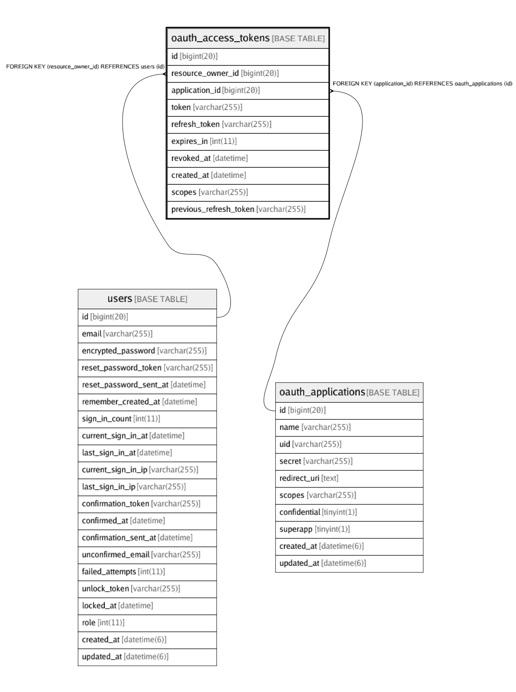

# oauth_access_tokens

## Description

<details>
<summary><strong>Table Definition</strong></summary>

```sql
CREATE TABLE `oauth_access_tokens` (
  `id` bigint(20) NOT NULL AUTO_INCREMENT,
  `resource_owner_id` bigint(20) DEFAULT NULL,
  `application_id` bigint(20) NOT NULL,
  `token` varchar(255) NOT NULL,
  `refresh_token` varchar(255) DEFAULT NULL,
  `expires_in` int(11) DEFAULT NULL,
  `revoked_at` datetime DEFAULT NULL,
  `created_at` datetime NOT NULL,
  `scopes` varchar(255) DEFAULT NULL,
  `previous_refresh_token` varchar(255) NOT NULL DEFAULT '',
  PRIMARY KEY (`id`),
  UNIQUE KEY `index_oauth_access_tokens_on_token` (`token`),
  UNIQUE KEY `index_oauth_access_tokens_on_refresh_token` (`refresh_token`),
  KEY `index_oauth_access_tokens_on_application_id` (`application_id`),
  KEY `index_oauth_access_tokens_on_resource_owner_id` (`resource_owner_id`),
  CONSTRAINT `fk_rails_732cb83ab7` FOREIGN KEY (`application_id`) REFERENCES `oauth_applications` (`id`),
  CONSTRAINT `fk_rails_ee63f25419` FOREIGN KEY (`resource_owner_id`) REFERENCES `users` (`id`)
) ENGINE=InnoDB DEFAULT CHARSET=utf8mb4 COLLATE=utf8mb4_0900_ai_ci
```

</details>

## Columns

| Name | Type | Default | Nullable | Children | Parents | Comment |
| ---- | ---- | ------- | -------- | -------- | ------- | ------- |
| id | bigint(20) |  | false |  |  |  |
| resource_owner_id | bigint(20) |  | true |  | [users](users.md) |  |
| application_id | bigint(20) |  | false |  | [oauth_applications](oauth_applications.md) |  |
| token | varchar(255) |  | false |  |  |  |
| refresh_token | varchar(255) |  | true |  |  |  |
| expires_in | int(11) |  | true |  |  |  |
| revoked_at | datetime |  | true |  |  |  |
| created_at | datetime |  | false |  |  |  |
| scopes | varchar(255) |  | true |  |  |  |
| previous_refresh_token | varchar(255) |  | false |  |  |  |

## Constraints

| Name | Type | Definition |
| ---- | ---- | ---------- |
| fk_rails_732cb83ab7 | FOREIGN KEY | FOREIGN KEY (application_id) REFERENCES oauth_applications (id) |
| fk_rails_ee63f25419 | FOREIGN KEY | FOREIGN KEY (resource_owner_id) REFERENCES users (id) |
| index_oauth_access_tokens_on_refresh_token | UNIQUE | UNIQUE KEY index_oauth_access_tokens_on_refresh_token (refresh_token) |
| index_oauth_access_tokens_on_token | UNIQUE | UNIQUE KEY index_oauth_access_tokens_on_token (token) |
| PRIMARY | PRIMARY KEY | PRIMARY KEY (id) |

## Indexes

| Name | Definition |
| ---- | ---------- |
| index_oauth_access_tokens_on_application_id | KEY index_oauth_access_tokens_on_application_id (application_id) USING BTREE |
| index_oauth_access_tokens_on_resource_owner_id | KEY index_oauth_access_tokens_on_resource_owner_id (resource_owner_id) USING BTREE |
| PRIMARY | PRIMARY KEY (id) USING BTREE |
| index_oauth_access_tokens_on_refresh_token | UNIQUE KEY index_oauth_access_tokens_on_refresh_token (refresh_token) USING BTREE |
| index_oauth_access_tokens_on_token | UNIQUE KEY index_oauth_access_tokens_on_token (token) USING BTREE |

## Relations



---

> Generated by [tbls](https://github.com/k1LoW/tbls)
