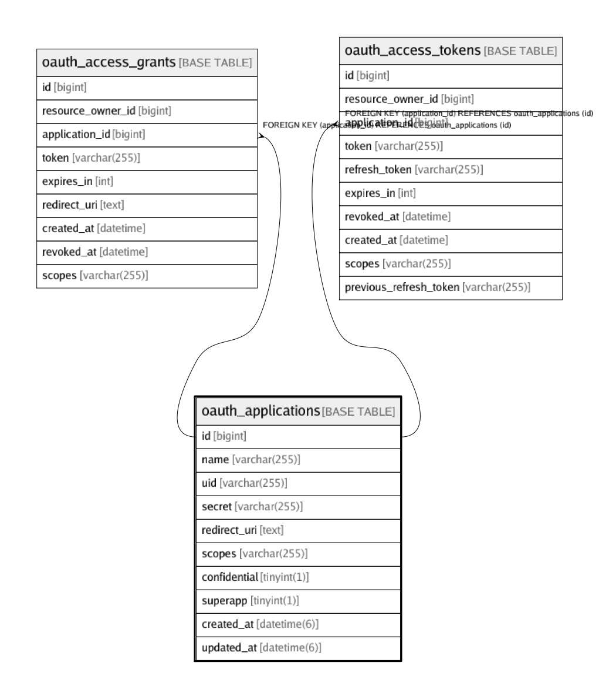

# oauth_applications

## Description

<details>
<summary><strong>Table Definition</strong></summary>

```sql
CREATE TABLE `oauth_applications` (
  `id` bigint(20) NOT NULL AUTO_INCREMENT,
  `name` varchar(255) NOT NULL,
  `uid` varchar(255) NOT NULL,
  `secret` varchar(255) NOT NULL,
  `redirect_uri` text NOT NULL,
  `scopes` varchar(255) NOT NULL DEFAULT '',
  `confidential` tinyint(1) NOT NULL DEFAULT '1',
  `superapp` tinyint(1) NOT NULL DEFAULT '0',
  `created_at` datetime(6) NOT NULL,
  `updated_at` datetime(6) NOT NULL,
  PRIMARY KEY (`id`),
  UNIQUE KEY `index_oauth_applications_on_uid` (`uid`)
) ENGINE=InnoDB DEFAULT CHARSET=utf8mb4 COLLATE=utf8mb4_0900_ai_ci
```

</details>

## Columns

| Name | Type | Default | Nullable | Children | Parents | Comment |
| ---- | ---- | ------- | -------- | -------- | ------- | ------- |
| id | bigint(20) |  | false | [oauth_access_grants](oauth_access_grants.md) [oauth_access_tokens](oauth_access_tokens.md) |  |  |
| name | varchar(255) |  | false |  |  |  |
| uid | varchar(255) |  | false |  |  |  |
| secret | varchar(255) |  | false |  |  |  |
| redirect_uri | text |  | false |  |  |  |
| scopes | varchar(255) |  | false |  |  |  |
| confidential | tinyint(1) | 1 | false |  |  |  |
| superapp | tinyint(1) | 0 | false |  |  |  |
| created_at | datetime(6) |  | false |  |  |  |
| updated_at | datetime(6) |  | false |  |  |  |

## Constraints

| Name | Type | Definition |
| ---- | ---- | ---------- |
| index_oauth_applications_on_uid | UNIQUE | UNIQUE KEY index_oauth_applications_on_uid (uid) |
| PRIMARY | PRIMARY KEY | PRIMARY KEY (id) |

## Indexes

| Name | Definition |
| ---- | ---------- |
| PRIMARY | PRIMARY KEY (id) USING BTREE |
| index_oauth_applications_on_uid | UNIQUE KEY index_oauth_applications_on_uid (uid) USING BTREE |

## Relations



---

> Generated by [tbls](https://github.com/k1LoW/tbls)
